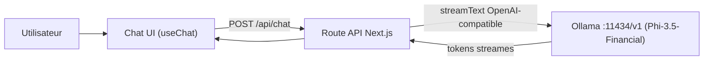

# Interface chat TechCorp — equipe DEV WEB

## Objectif (perimetre DEV WEB uniquement)

Livrer une interface web de chat professionnelle, en temps reel (streaming), branchee sur l'API du serveur d'inference de l'equipe INFRA. Defaut: Ollama sur `http://localhost:11434`, mais URL + nom de modele **configurables** pour ne pas etre bloques tant qu'INFRA n'a pas tranche.

## Contraintes de rendu (CONSIGNES.md du repo officiel)

- Le livrable doit vivre dans `hackathon_ynov/rendu/devweb/` (repo H04K/hackathon_ynov).
- Doit se lancer en **une seule commande** depuis `rendu/devweb/`.
- Doit **afficher l'historique** (fait) et **l'etat de connexion au serveur** (connecte / deconnecte) -> obligatoire.
- Push sur une branche `groupe-devweb-<numero>`, commits reguliers, oral de 5 min.

## Architecture

Le navigateur ne parle jamais directement a Ollama: tout passe par notre route `/api/chat` (evite les soucis CORS et permet d'injecter le system prompt + parametres d'inference).

## Stack

- Next.js (App Router) + TypeScript
- Vercel AI SDK (`ai`, `@ai-sdk/react`) avec provider OpenAI-compatible pointe sur Ollama (`/v1`)
- Tailwind + shadcn/ui pour une UI propre rapidement
- Config via `.env.local`: `OLLAMA_BASE_URL` (defaut `http://localhost:11434/v1`), `OLLAMA_MODEL` (ex. `phi3.5` / nom du Modelfile fourni par INFRA)

> Note: les APIs exactes de l'AI SDK (v6) seront verifiees contre `node_modules/ai/docs/` au moment du code (le SDK evolue vite), pas figees de memoire.

## Fonctionnalites

- Fil de conversation avec bulles user/assistant et reponse **streamee token par token**
- Indicateur d'etat (en cours de generation, stop, erreur de connexion serveur)
- Panneau reglages: URL du serveur, nom du modele, system prompt (oriente finance/business), temperature/max tokens
- Indicateur de connexion au serveur d'inference (health check)
- Gestion d'erreurs claire si le serveur INFRA est down
- Bouton "nouvelle conversation" + rendu markdown des reponses

## Etapes

1. Init projet Next.js + Tailwind + shadcn, structure de dossiers
2. Route `app/api/chat/route.ts`: `streamText` via provider OpenAI-compatible -> Ollama, system prompt finance, params d'inference
3. UI chat `app/page.tsx` avec `useChat` (transport vers `/api/chat`), bulles + streaming + auto-scroll
4. Panneau reglages + persistance locale (localStorage) de l'URL/modele/system prompt
5. Health check `/api/health` + badge de connexion + gestion d'erreurs
6. Polish UI (theme TechCorp, responsive) + README de deploiement (livrable doc)

## Points de coordination equipe

- INFRA cree le modele via `ollama_server/Modelfile` (`FROM phi3.5`, system prompt finance inclus) avec `ollama create <nom>`. Defaut cote front: `OLLAMA_MODEL=phi3.5`, configurable des qu'on connait le nom.
- INFRA doit fournir: URL + port du serveur, et le **nom exact du modele** charge dans Ollama (pour `OLLAMA_MODEL`). Defaut: `http://localhost:11434`.
- Comme l'integration est configurable, on peut commencer immediatement avec un Ollama local (ex. `ollama run phi3.5`) puis basculer sur le serveur d'INFRA en changeant `.env.local`.

## Livrables (cf. sujet)

- Interface web complete et fonctionnelle
- Integration API temps reel avec le serveur d'inference
- README technique (lancement, config, integration)
